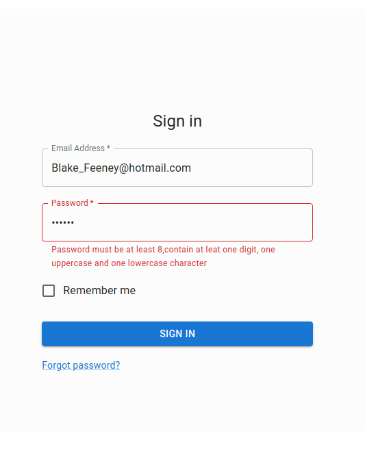
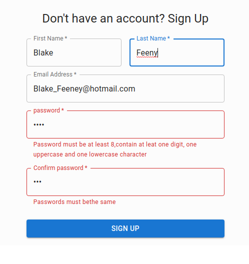
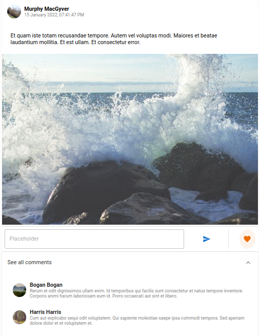
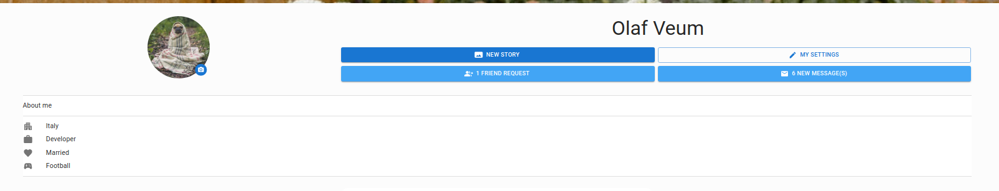
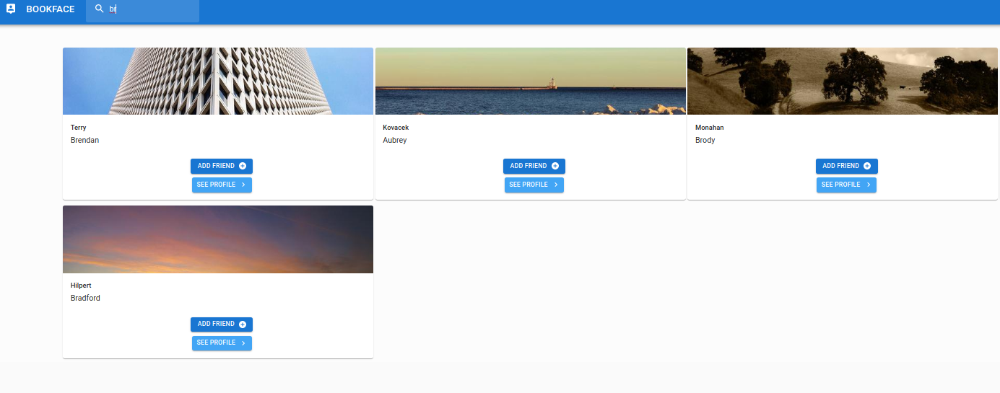
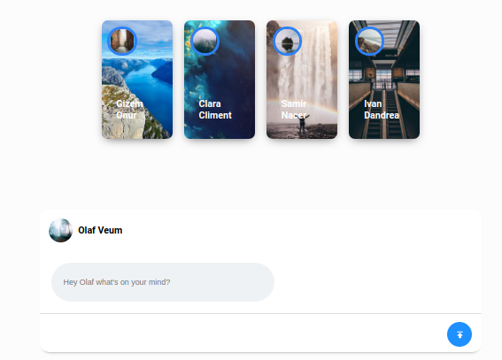

# BookFace_Project
## App/Front-end
### Technologies
---
- React
- Material UI
- Apollo Client
- CSS


## Server/Backe-end
### Technologies
---

- Node.JS
- Express.JS
- Graphql
- Apollo Server
- Typescript
- MongoDb
- Redis


## Install
---
### Start the Server 
```
cd server
npm run watch
npm run start
```
### Run the Client App
```
cd app
npm run start

```
### Install & Run Redis

```
redis-server

```

## Feauturs
---
- [Server Query](function.md)
- Login/Logout/Signup
- Add Post
- Search Friends
- See FriendsPosts (WIP)
- Send Friend Request/Accept (WIP)
- Update Personal Info (WIP)
- Like Comment (WIP)
- Like Post


## Some Snapshot
---
### Login

### Register

### Post

### Profile

### Search

### Reels



## Note

Must overload module "express-session"
to add userid attribute to req.session
Set "request.credentials": "include",
into Graphql PLayGround to recvie session cookie
